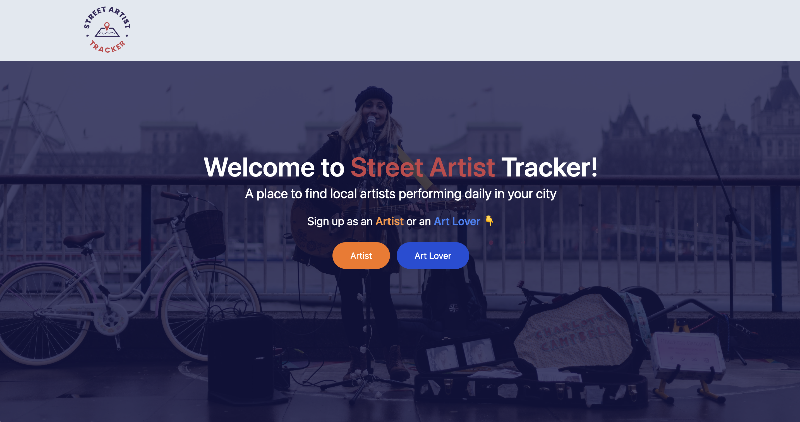
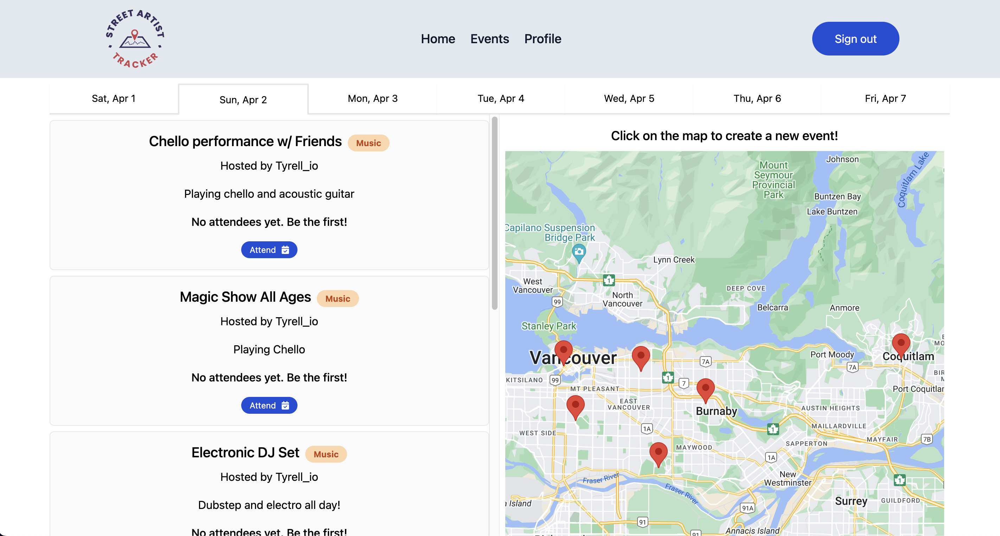
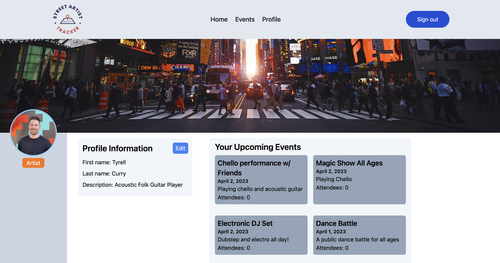

# Street Artist Tracker
### A hackathon project for [MapHacks 2](https://organize.mlh.io/participants/events/9159-maphacks-2) - Mar.31st - Apr.2nd 2023!
### View [Video Demo](https://www.youtube.com/watch?v=zqrqL3og6x0)
### View [Live Page](https://street-artists-tracker.vercel.app/)

## Hackathon Team:
- [William Sinclair](https://github.com/WilliamSinclairF) - Full-Stack Software Engineer
- [Tyrell Curry](https://github.com/tyrellcurry) - Frontend Developer

## Table of contents

- [Overview](#overview)
  - [The Hackathon challenge](#the-hackathon-challenge)
  - [Screenshots](#screenshots)
- [Our process](#our-process)
  - [Built with](#built-with)
  - [What we learned](#what-we-learned)
  - [Continued development](#continued-development)
  - [Useful resources](#useful-resources)

## Overview

### The Hackathon Challenge

An application built for Street Artists to list their upcoming performances in cities with event details and map pins! A place for Art Lovers to explore local artists in their cities!

### Screenshots
#### Homepage

#### Events Tab

#### Artist Pofile

## Our Process

### Built with

- T3 Stack
- NextJS
- Prisma
- TRPC
- TailwindCSS
- Google Maps API
- Local Browser Storage

### What we learned

- This was our first hackathon colaborating together and we got to explore Prisma and TRPC and learn some new things working with that tech!
- Quick collaboration on Github for code efficiency 
- Brainstorming using Figma whiteboards

### Continued development

 - We would like to expand some features such as adding an event favouriting option and enhancing some of the UI

### Useful resources

- [Major League Hacking](https://mlh.io/)
- [Upcoming Hackathons](https://mlh.io/seasons/2023/events)
- [MLH Twitch](https://www.twitch.tv/mlh)